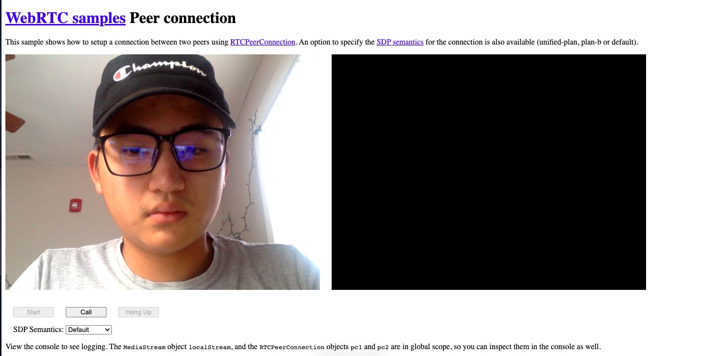
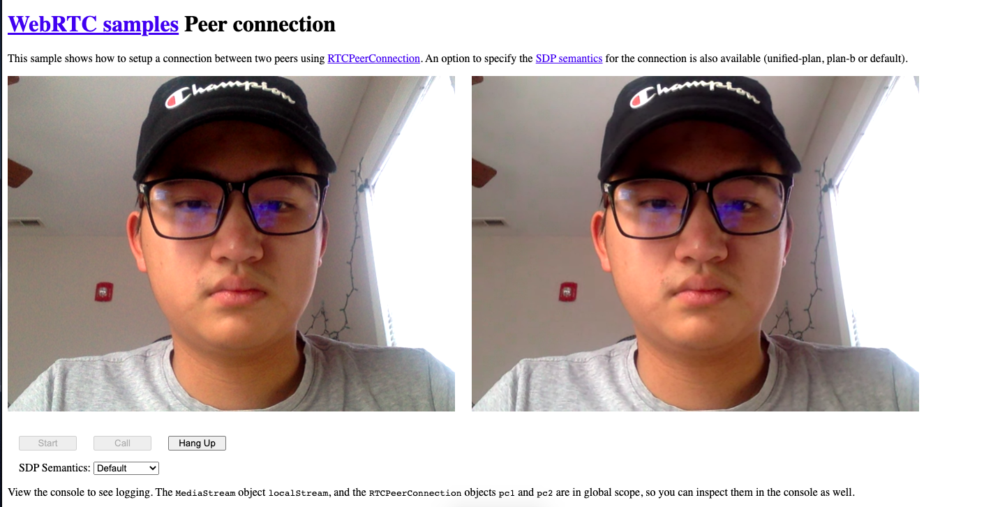

# Project 3 

### Phase 1

To run this sample, download or clone it to local and open the index.html directly without building anything.

This sample is from WebRTC official sample repository and it is one of the examples. For other examples in that repository, you can run it simply open the html file.

The expectation for this example is to show a peer to peer connection locally without a server right now.  The web design is pretty simple. When you open the website (index.html), the browser will request to access microphone and camera when you click the "Start". When you give the browser the access, the page will looks like this.



Then, if you click "call", the js script will create a "remote" object to connect to other "user". If you run it locally, the other "user" is also yourself. The page will looks like this.



#### Key feature

This example shows the very simple usage for WebRTC. It can establish connection between user and also access camera and audio on client side. The WebRTC provides various API to implement every function we need for a online meeting.

##### Access camera and audio

###### API usage

We use navigator.mediaDevices.getUserMedia to request access for user media device such as camera and audio. It pass a constraints to get which media we want. For example, if we only need camera, we can set the constraint as 

```javascript
{ video: true}
```

Then, it will only request permission for camera. Also, the script can require permission with parameter. For example, it can set up the resolution for camera.

```javascript
{
  video: {
    width: { min: 1280 },
    height: { min: 720 }
  }
}
```

###### Return Value

The return value of this API is an object and can be stored in local variable, LocalStream. 

###### Exceptions

This API can also raises some exceptions. One of the most common exceptions is that if the user does not give permission, it will throw "NotAllowedError". The other common exceptions are "NotFoundError", which is no device founded, "AbortError", which device prevents the script to use.

##### Call

The next feature for this demo is the RTCPeerConnection API. This API constructs a object which represents the connection between the local user and the remote user. You can also pass your configuration for the connection to construct the object. Otherwise, it will configure to appropriate basic defaults for the connection.

Once you construct the object, you can add them to the event listener to exchange data between local and remote, which is building online meeting.

##### SDP Semantics

This script also support two types of SDP semantics, plan B and unified plan. The Google is preparing to remove the plan B and migrate all current WebRTC app to unified plan.

###### What is SDP Semantics

The SDP message is a message which contains information that describes individual media tracks which is important for us to do peer-to-peer connection. 

###### Difference between plan B and unified plan

Why we don't need plan B anymore?  The first reason is that the plan B assumes all media tracks that share a media type also share a single transport, which will cause a large amount of connections when you do a group meeting. The unified plan will significantly reduces the number of connections by using the SDP specification called BUNDLE.

On the other hands, the plan B also have compatibility issue. A great example from Temasys that "when a peer on a Chrome 71 browser connects to a peer on any Firefox browser updated since 2015. In this case, the peer using Firefox would only be able to see the first tracks of each m= line in a “plan-b” formatted SDP message; Firefox ignores the rest of the tracks in the m= line because it expects to find only one media track in it.".  In that case, the Google is trying to remove plan B so that it won't cause any compatibility issues between peer to peer connection using different browser.


#### Code explanation 

The website request access to user media when you click "Start" button. The code looks like this.

```javascript
async function start() {
  console.log('Requesting local stream');
  startButton.disabled = true;
  try {
    const stream = await navigator.mediaDevices.getUserMedia({audio: true, video: true});
    console.log('Received local stream');
    localVideo.srcObject = stream;
    localStream = stream;
    callButton.disabled = false;
  } catch (e) {
    alert(`getUserMedia() error: ${e.name}`);
  }
}
```

The start function is an async function so that it have to return something. When you click the button, it will become grey and unclickable. Then, It will create a variable called "stream" to get user camera and audio with permission. When you click "Yes" on the pop up, the browser will give permission and the camera will turns on.

The "Call" function, in the next, will create connection between users. It will transfer the video device and audio device data between users. The code looks like this.

```javascript
async function call() {
  callButton.disabled = true;
  hangupButton.disabled = false;
  console.log('Starting call');
  startTime = window.performance.now();
  const videoTracks = localStream.getVideoTracks();
  const audioTracks = localStream.getAudioTracks();
  if (videoTracks.length > 0) {
    console.log(`Using video device: ${videoTracks[0].label}`);
  }
  if (audioTracks.length > 0) {
    console.log(`Using audio device: ${audioTracks[0].label}`);
  }
  const configuration = getSelectedSdpSemantics();
  console.log('RTCPeerConnection configuration:', configuration);
  pc1 = new RTCPeerConnection(configuration);	//Create instance to build connection
  console.log('Created local peer connection object pc1');
  pc1.addEventListener('icecandidate', e => onIceCandidate(pc1, e));
  pc2 = new RTCPeerConnection(configuration);
  console.log('Created remote peer connection object pc2');
  pc2.addEventListener('icecandidate', e => onIceCandidate(pc2, e));
  pc1.addEventListener('iceconnectionstatechange', e => onIceStateChange(pc1, e));
  pc2.addEventListener('iceconnectionstatechange', e => onIceStateChange(pc2, e));
  pc2.addEventListener('track', gotRemoteStream);

  localStream.getTracks().forEach(track => pc1.addTrack(track, localStream));
  console.log('Added local stream to pc1');

  try {
    console.log('pc1 createOffer start');
    const offer = await pc1.createOffer(offerOptions);
    await onCreateOfferSuccess(offer);
  } catch (e) {
    onCreateSessionDescriptionError(e);
  }
}
```

This function will creates instance to hold the connection and add them to the listen to implement video meeting function. Once the connection established, the listener will keeps tracking the Media stream and load it to local stream and then display it .

The "hangup" function is pretty simple. It will closes pc instances and set them to null. Then , the meeting will be terminated. 

```javascript
function hangup() {
  console.log('Ending call');
  pc1.close();
  pc2.close();
  pc1 = null;
  pc2 = null;
  hangupButton.disabled = true;
  callButton.disabled = false;
}

```

That is the main function in this example, there are still a lot of help function to support the meeting.


### Phase 2

##### Overall

To analyze the security hole for session creation for this demo, the first thing we need to find out is the method that users communicate. In WebRTC, we have such method called ICE candidates. The ICE candidates is that each users propose the best way to communicate first, then it will select the worst candidates among all users. There are two types of candidate (communication method), one is UDP and the other one is TCP. The ideal communication method is UDP because it is faster. However, it may not available for some users to communicate via UDP.

So, when we are able to choose the candidate, we can use the candidate to connect to TURN server to create a session for meeting. So, if we want to hijack a meeting, we need to find out the security hole in UDP or TCP.

##### UDP security hole

UDP is a very simple protocol to transfer message. The UDP header format looks like this.

It clearly shows that the communication is identified by source IP and port  and destination IP and port. The message are not acknowledged and the reception is also not guaranteed. In that case, it may lose some packets during communication but it should not be a big deal. 

According to EC521, thanks to Professor Stringhini, UDP hijacking is possible in some scenario. Since the UDP cannot verify who send the message to require session creation. If we know the IP addresses for the two endpoints and the port for two endpoints. We can establish a new connection with server pretending to be "verified" user and get into the meeting. If the meeting is hosting on a local network such as in a company network, we can use ARP spoofing to bind the user's MAC address with the attacker's IP address, which can redirect all message from server to the attacker endpoint. However, ARP spoofing only work at local network.

##### TCP security hole

The TCP is a more complicated protocol. The header format looks like this.

/tcp-headers-f2c0881ea4c94e919794b7c0677ab90a.jpg)

The TCP has sequence number and acknowledgement number to make sure the integrity of packets.  The entire TCP connection setup scheme is also different.

 

So, to inject data into the connection is not easy but possible. The attacker needs to know source IP, destination IP, source port, destination port, sequence number and acknowledgment number. One of the common method to do the hijacking is to guess initial sequence number. The ideal initial sequence number generation should be "random" but in real-world it is not. According to "techrepublic", "the TCP protocol description recommends that the value of this 32-bit counter be increased by 1 every 4 microseconds. What do we see when this practice is implemented? Unfortunately, we see very poor results. In early Berkeley-compatible UNIX kernels, the value of this counter increased by 128 every second and by 64 with every new connection. Analysis of the Linux OS sources shows that the OS generates the ISN value not randomly, but as a dependent variable of the current time"

The example above shows that the attacker can guess the sequence number by current time. If we have enough connection log from the server, we can find a method to calculate the next initial sequence number and then inject our data to create a new connection to the server.

##### Other security issues

There are some other way to attack the WebRTC TURN server. It may or may not related to project 3 but I want to mention them because they may also be a possible way for us to find the security hole for our term project

###### DoS attack

In our term project, we use WebSocket to connect with server. The DoS is a very common way to disable the server. It is also the easiest way to do it. Simply use a large amount of client to connect to server.

###### Cross-site WebSocket Hijacking

It is also a common attack method. It is related to the cross-site request forgery vulnerability on the WebSocket handshake because the WebSocket does not authenticate user in handshake process. An attacker can create a malicious web page on their own domain which establishes a cross-site WebSocket connection to the vulnerable application. The application will handle the connection in the context of the victim user's session with the application. In that case, the attacker can perform unauthorized actions as the victim user and retrieve sensitive data that the user can access.

### Reference

https://temasys.io/ripping-off-the-band-aid-chromes-shift-to-unified-plan/

https://developer.mozilla.org/en-US/docs/Web/API/WebRTC_API/Connectivity#:~:text=for%20your%20needs.-,ICE%20candidates,or%20through%20a%20TURN%20server

https://www.techrepublic.com/article/tcp-hijacking/

https://www.neuralegion.com/blog/websocket-security-top-vulnerabilities/

https://www.neuralegion.com/blog/websocket-security-top-vulnerabilities/